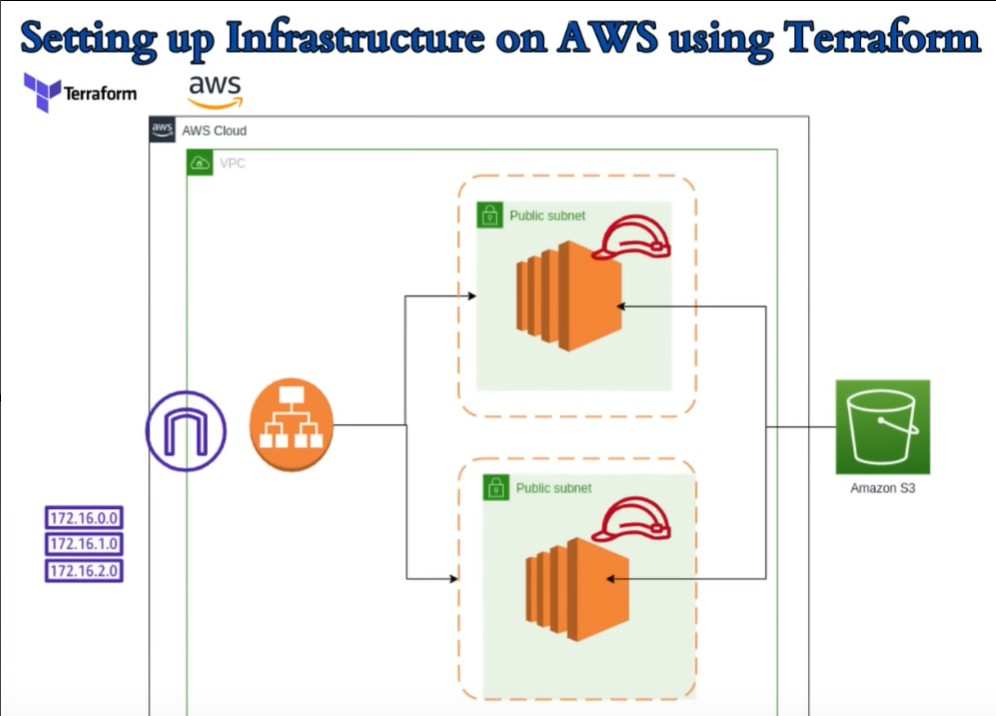

# 🚀 AWS Infrastructure Provisioning using Terraform


Infrastructure as Code (IaC) project that provisions a highly available AWS environment using **Terraform**. This project automates the deployment of networking components, compute resources, storage, and security configurations, making infrastructure deployment consistent, repeatable, and scalable.

---

# 📖 Architecture

> Save the architecture diagram as `AWS_Terraform_Infra.jpg` at root of your repository.

<p align="center">
  
</p>

### Architecture Overview

The infrastructure consists of:

- **Amazon VPC** for network isolation
- **Public Subnets** across multiple Availability Zones
- **Internet Gateway** for internet connectivity
- **Security Groups** for controlled access
- **EC2 Instances** deployed in public subnets
- **Amazon S3 Bucket** for object storage
- Infrastructure fully managed using **Terraform**

---

# 🏗️ Project Structure

```text
Terraform_AWS_Project/
│
├── main.tf                 # Main infrastructure configuration
├── variables.tf            # Input variables
├── outputs.tf              # Output values
├── provider.tf             # AWS provider configuration
├── terraform.tfvars        # Variable values
├── images/
│   └── architecture.png
└── README.md
```

---

# ⚙️ Technologies Used

- Terraform
- Amazon Web Services (AWS)
- Amazon EC2
- Amazon S3
- Amazon VPC
- Internet Gateway
- Security Groups

---

# ✨ Features

- Infrastructure as Code (IaC)
- Automated AWS resource provisioning
- Modular and reusable Terraform configuration
- Secure networking using VPC
- Public subnet deployment
- EC2 instance provisioning
- S3 bucket creation
- Easy to modify and extend

---

# 📋 Prerequisites

Before running this project, ensure you have:

- Terraform >= 1.x
- AWS CLI installed
- AWS Account
- IAM User with required permissions
- Configured AWS credentials

Verify installations:

```bash
terraform -version
aws --version
```

Configure AWS credentials:

```bash
aws configure
```

---

# 🚀 Deployment Steps

## 1. Clone the Repository

```bash
git clone https://github.com/navjyotsingh17/Terraform_AWS_Project.git

cd Terraform_AWS_Project
```

---

## 2. Initialize Terraform

```bash
terraform init
```

---

## 3. Validate Configuration

```bash
terraform validate
```

---

## 4. Review Execution Plan

```bash
terraform plan
```

---

## 5. Deploy Infrastructure

```bash
terraform apply
```

Type

```text
yes
```

when prompted.

---

## 6. Destroy Infrastructure

```bash
terraform destroy
```

---

# 📂 Resources Created

Depending on your Terraform configuration, this project provisions:

- VPC
- Public Subnets
- Internet Gateway
- Route Tables
- Security Groups
- EC2 Instances
- Amazon S3 Bucket

---

# 🔒 Security

This project follows Infrastructure as Code best practices:

- Security Groups restrict unnecessary access
- Terraform state tracks infrastructure changes
- AWS IAM authentication
- Easily configurable variables

---

# 📊 Infrastructure Workflow

```text
Terraform
      │
      ▼
 AWS Provider
      │
      ▼
Create VPC
      │
      ▼
Create Public Subnets
      │
      ▼
Attach Internet Gateway
      │
      ▼
Configure Security Groups
      │
      ▼
Launch EC2 Instances
      │
      ▼
Provision S3 Bucket
```

---

# 💡 Benefits

- Automated infrastructure deployment
- Consistent environments
- Version-controlled infrastructure
- Easy rollback and modifications
- Reduced manual errors
- Scalable architecture

---

# 📚 Terraform Commands

```bash
terraform init

terraform fmt

terraform validate

terraform plan

terraform apply

terraform destroy
```

---

# 👨‍💻 Author

**Navjyot Singh**

GitHub:  
https://github.com/navjyotsingh17

---

# ⭐ Support

If you found this project useful, consider giving it a ⭐ on GitHub.

Happy Terraforming! 🚀